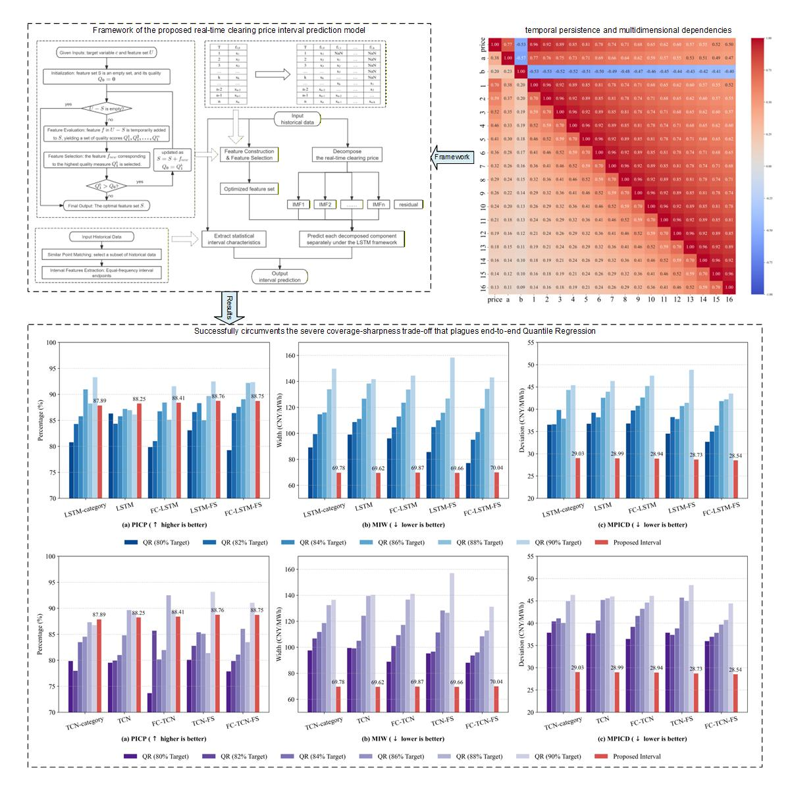

# Non-parametricIntervalPrediction

[](https://www.python.org/downloads/)
[](https://opensource.org/licenses/MIT)

This repository contains the official implementation of the paper:  
**"A Deep Learning-based Model for Interval Prediction of Real-time Clearing Price in Electricity Market"**

## 💡 Highlights
* A novel electricity price interval prediction model is proposed.
* Time-shift FC and greedy FS optimize electricity price feature dimensions.
* VMD and CEEMDAN resolve extreme non-stationarity in clearing prices.
* Non-parametric interval breaks coverage-sharpness trade-off in quantile regression.

## 🖼️ Graphical Abstract 


## ⚙️ Requirements
Dependencies are listed in `requirements.txt` and can be installed via pip:
```bash
pip install -r requirements.txt
```

## 🚀 Usage
The core implementations and experimental pipelines are organized within Jupyter Notebooks, supported by a main script (`models/myFunctions.py`) which encapsulates all core classes: Neural Networks, Feature Selection, Signal Decomposition, and Cluster Analysis.

To reproduce the experiments or apply the models to your own data:

1. **Prepare the Data**: Place your dataset in the appropriate directory and update the data loading path in the notebooks.
2. **Load Core Functions**: Ensure `myFunctions.py` is in the same directory as the notebooks so it can be imported correctly.
3. **Run Experiments**: Open and run the Jupyter Notebooks in the `models/` folder sequentially or based on your specific focus:
   - Run `01_LSTM_Experiments.ipynb` to evaluate the point prediction accuracy with our proposed feature processing and decomposition.
   - Run `02_Regression_Experiments.ipynb` to benchmark classical regression models (LR, Decision Tree, Random Forest, etc.).
   - Run `03_QuantileLSTM_Experiments.ipynb` and `04_QuantileTCN_Experiments.ipynb` to compare the performance of parametric end-to-end Quantile Regression (LSTM-QR and SOTA TCN-QR) against our proposed non-parametric interval methodology.


## 📊 Data Availability Statement
Due to confidentiality and licensing agreements regarding the real-world electricity market operations, the raw operational dataset is not publicly uploaded to this repository.

However, the data is available upon reasonable request for academic and research purposes. If you wish to access the dataset to reproduce our results, please contact: [yangjun04@buaa.edu.cn](mailto:yanngjun04@buaa.edu.cn) or [leizhu@bnu.edu.cn](mailto:leizhu@bnu.edu.cn)

## 📎 Citation
If you find this code or our paper useful for your research, please consider citing our work:

```bibtex

```
